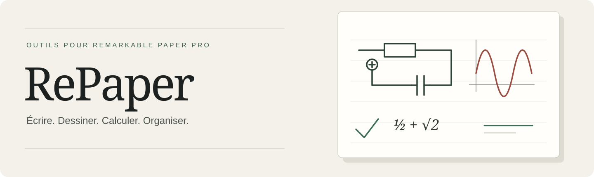
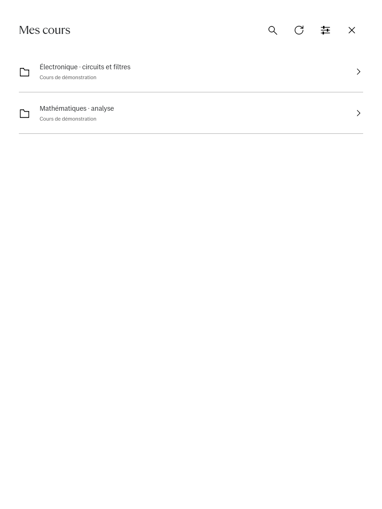
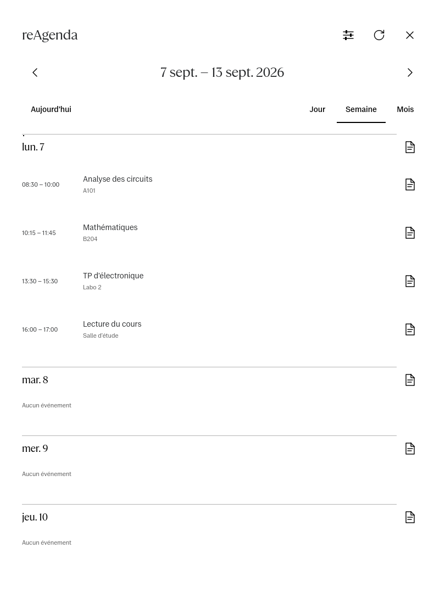
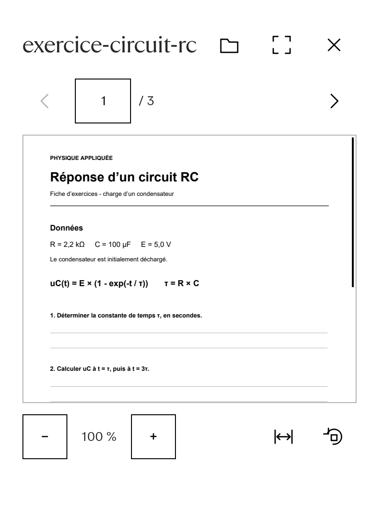

<p align="center"></p>

<p align="center">
  Des outils pour étudier et travailler sur <strong>reMarkable Paper Pro</strong>.<br>
  Dessin dans les carnets natifs, calculatrice et PDF en fenêtre, cours et agenda.
</p>

<p align="center">
  <a href="docs/mods/README.md">Découvrir les mods</a> ·
  <a href="docs/INSTALLATION.md">Installation et compatibilité</a> ·
  <a href="docs/BUILDING.md">Compiler</a> ·
  <a href="https://github.com/Fefedu973/RePaper/issues">Signaler un problème</a>
</p>

<p align="center">
  <a href="https://github.com/Fefedu973/RePaper/actions/workflows/ci.yml"></a>
  
  
  <a href="LICENSE"></a>
</p>

## Un carnet, plusieurs outils

**RePaper** réunit des extensions de l’éditeur reMarkable et des applications C++ / Qt Quick. Les outils de dessin travaillent dans le carnet actif. La calculatrice et le lecteur PDF peuvent rester à côté de vos notes. Les cours et l’agenda disposent de leurs propres applications.

Projet communautaire indépendant, sans affiliation avec reMarkable.

| Mod | À quoi il sert | Où il fonctionne |
| --- | --- | --- |
| **[reInk](docs/mods/reink.md)** | Tracer des formes, des lignes, des pointillés et des flèches ; régler leurs propriétés. | Éditeur natif |
| **[reSelect](docs/mods/reselect.md)** | Sélectionner, déplacer, redimensionner, tourner et modifier les objets RePaper. | Éditeur natif |
| **[reStencil](docs/mods/restencil.md)** | Poser des symboles scientifiques, des composants électroniques, des tableaux et des graphes. | Éditeur natif |
| **[reCalc](docs/mods/recalc.md)** | Écrire et calculer des expressions avec fractions, racines et puissances. | AppLoad, en fenêtre ou en plein écran |
| **[rePDF](docs/mods/repdf.md)** | Garder un énoncé ou un document PDF visible pendant la prise de notes. | AppLoad, en fenêtre |
| **[reAgenda](docs/mods/reagenda.md)** | Consulter son planning et retrouver les notes liées à un événement. | AppLoad |
| **[reMoodle](docs/mods/remoodle.md)** | Parcourir ses cours Moodle et importer des documents dans la bibliothèque. | AppLoad |
| **[AppLoad et Paper Bridge](docs/mods/appload.md)** | Lancer les applications, gérer leurs fenêtres et relier leurs actions à la tablette. | Infrastructure commune |

### Dessiner sans quitter ses notes

<p align="center"></p>

Les palettes donnent accès aux outils, aux couleurs et aux propriétés. reStencil conserve les symboles récents et propose des repères de placement. Les objets et fils associés peuvent être transformés ensemble. Les aperçus et guides disparaissent après la pose ; le dessin reste dans le document.

### Ses documents et son agenda à portée de main

<p align="center">
  
  
  
</p>

Ces captures proviennent des interfaces QML et de données de démonstration. Elles illustrent les interfaces ; elles ne mesurent pas la latence de l’écran e-paper. [Voir les interfaces et leur conception](docs/design/README.md).

## État de cette publication

Cette première publication fournit **les sources, les tests, les correctifs et les guides**. La cible validée est la **Paper Pro `ferrari`, OS 3.28.0.169, Qt 6.10.3**. Les autres modèles et versions du système ne sont pas validés. Les intégrations natives dépendent de cette version précise de Xochitl.

La refonte de septembre réduit les mises à jour de l’interface, déplace le traitement des associations d’objets en arrière-plan et allège les aperçus et le catalogue Stencil. Les **32 suites de tests de l’éditeur** passaient lors de la validation du 9 septembre ; le zoom et l’ouverture de Stencil ont ensuite été essayés sur tablette avec une amélioration nette rapportée par l’utilisateur. [Détails et limites des mesures](extensions/reink/NATIVE_RESPONSIVENESS.md).

**Aucun binaire natif précompilé n’est joint à cette publication.** La distribution des modules AppLoad/reInk reste à résoudre pour leur combinaison actuelle de dépendances GPL v2 et LGPL v3. La licence MIT couvre le code original, sans remplacer les licences des dépendances. [Licences et provenance](NOTICE.md) · [Versions et changements](CHANGELOG.md).

RMChat reste [archivé](apps/rmchat/ARCHIVED.md), exclu des builds habituels et des applications proposées.

## Commencer

```sh
git clone --recurse-submodules https://github.com/Fefedu973/RePaper.git
cd RePaper
```

- **Découvrir un outil** : ouvrir sa fiche dans [le catalogue](docs/mods/README.md).
- **Tester sur PC** : suivre le [guide de compilation](docs/BUILDING.md). Le banc PC ne lance pas le firmware reMarkable.
- **Préparer une tablette** : lire la [compatibilité et le guide d’installation](docs/INSTALLATION.md).
- **Contribuer** : voir [CONTRIBUTING.md](CONTRIBUTING.md) et les [issues](https://github.com/Fefedu973/RePaper/issues).

## Organisation du dépôt

```text
apps/                      Applications et anciens bancs de dessin autonomes
extensions/reink/          Intégration native reInk / reSelect / reStencil
extensions/editor-common/  Adaptateur, objets, entrées et aperçus
shared/                    Interface, clavier, dessin et services communs
bridge/                    Paper Bridge local
packaging/appload/          Intégration et correctifs AppLoad
moodle-connect/            Portail de liaison Moodle à configurer séparément
tools/                     Compilation, packaging et validation
docs/mods/                 Présentation et prise en main de chaque mod
```

Le firmware, les polices propriétaires reMarkable, les profils de comptes et les documents personnels ne font pas partie du dépôt.

<sub>English: RePaper is an independent collection of native drawing tools and Qt applications for reMarkable Paper Pro. This source release targets ferrari / OS 3.28.0.169; prebuilt native modules are not distributed. Documentation is currently in French.</sub>
