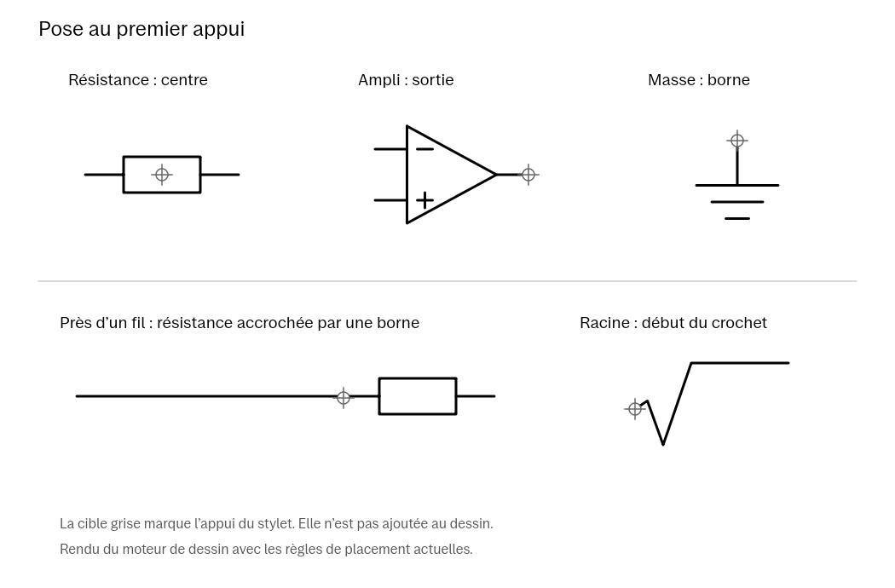

# reStencil

**Des symboles et des graphiques réutilisables pour vos schémas de cours.**

reStencil insère des objets vectoriels dans la page active depuis la barre native. Choisissez un symbole, posez-le au stylet et reprenez sa taille ou ses paramètres avec [reSelect](reselect.md). Le catalogue et le moteur de dessin fonctionnent localement.

*Planche produite par le moteur de dessin du dépôt. Les cibles grises expliquent le geste et ne sont pas enregistrées dans le carnet.*

## Un catalogue pour construire la page

| Famille | Exemples et possibilités |
| --- | --- |
| Électronique | Résistances IEC/ANSI, condensateurs, bobine, diodes, transistors, amplificateur, sources, masses et connexions. |
| Dessin scientifique | Ampoule, racine carrée étirable, générateur de tension simple et flèche de tension facultative pour les dipôles. |
| Tableau | Nombre de lignes et de colonnes indépendants, de 1 à 30. |
| Graphe à deux axes | Quadrillage, bornes et courbe exponentielle, du second ordre ou sinusoïdale. |
| Diagramme de Bode | Axe de fréquence logarithmique, gain ou phase et courbe du second ordre facultative. |

Les formes scientifiques, les commandes de pose et la sinusoïde font partie des évolutions de septembre. La liste exacte disponible dépend du binaire installé ; l’archive 0.8.2 initiale ne doit pas être assimilée à toutes les évolutions du code courant.

## Placer et réutiliser

1. Ouvrez **reStencil** dans un carnet et choisissez un symbole dans le catalogue.
2. Pour un tableau ou un graphe, ajustez les paramètres de l’aperçu, puis touchez **Placer**.
3. Touchez la page pour une pose simple, ou tracez pour définir la taille. Un appui immobile d’environ une seconde au début du tracé verrouille les proportions.
4. Utilisez la barre de pose pour retrouver les derniers symboles et choisir l’orientation ou la flèche de tension lorsque ces commandes s’appliquent.
5. Avec **reSelect → Propriétés**, modifiez l’objet ; **Configurer le tableau ou le graphique** rouvre ses paramètres.

Les bornes compatibles prennent priorité près d’un point d’accroche. Le code courant permet notamment de poser un composant sur l’extrémité libre d’un fil et de conserver cette connexion lors des transformations reconnues. Les repères d’alignement facilitent la pose et ne sont pas exportés.

## Disponibilité, compatibilité et état

**Cette publication fournit les sources, sans module `.so` prêt à installer.** Dans l’intégration tablette développée, reStencil natif est inclus dans **`reink-editor.so`**, avec reInk et reSelect. Le dernier numéro de paquet local documenté est **0.8.2** ; ce binaire n’est pas joint.

La cible est **Paper Pro `ferrari`, OS 3.28.0.169, Qt 6.10.3**, avec XOVI et Qt Resource Rebuilder et l’empreinte exacte de Xochitl indiquée dans le [profil de compatibilité](../../extensions/reink/compatibility.json). Aucun autre modèle ou firmware n’est validé. Voir les conditions de reconstruction et d’utilisation expérimentale dans le [guide d’installation](../INSTALLATION.md).

Les tests locaux couvrent la géométrie, les formules, les limites, le fond blanc, les paramètres, la persistance et les actions QML. Le chargement des ajouts scientifiques a été contrôlé sur la tablette ; tous leurs rendus physiques n’ont pas fait l’objet d’une validation complète. Après la refonte du 9 septembre, l’utilisateur a confirmé une ouverture nettement plus fluide du panneau. Les 32 suites de l’hôte passent ; aucun débit d’images ou temps de réponse physique n’est revendiqué.

## Limites utiles

- Les axes des graphes restent à annoter à la main. Les bornes choisies découpent les courbes ; élargissez-les pour voir un dépassement.
- Le Bode est limité à huit décades et le graphe temporel à 32 oscillations. Les champs acceptent point ou virgule décimale ; une valeur invalide empêche l’application.
- Le fond blanc des tableaux et graphes masque ce qui est en dessous. Désactivez-le pour une forme transparente. Ces objets n’emploient pas de style tireté.
- Les propriétés restent disponibles lorsque tous les traits correspondent encore au modèle reconnu. Les associations sont locales ; leur synchronisation n’est pas garantie.
- Le programme `apps/restencil` et son adaptateur `extensions/restencil` sont les **anciens bancs PC**. Leur page d’essai et leurs exports ne décrivent pas le module natif actuel de `extensions/reink`.

## Documentation technique

- [Paramètres et formules des pochoirs scientifiques](../stencils-scientifiques.md)
- [Gestes de pose, flèches de tension et exemples](../design/README.md)
- [Module natif commun](../../extensions/reink/README.md)
- [Refonte du catalogue et de l’aperçu](../../extensions/reink/NATIVE_RESPONSIVENESS.md)

[Retour à RePaper](../../README.md) · [reInk](reink.md) · [reSelect](reselect.md)
